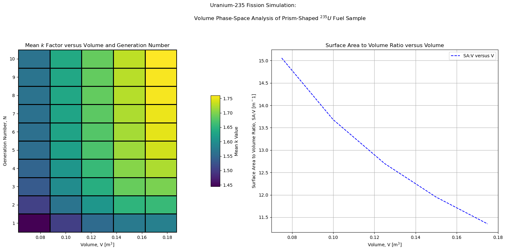

# Uranium-235 Nuclear Fission Geometry Simulation

Numerical simulation investigating how geometric properties of a fissile system influence neutron retention and the ability to sustain a nuclear fission chain reaction.

## Overview

This project models neutron-induced fission events in Uranium-235 in order to investigate how the geometric properties of a fissile system influence the development and stability of a nuclear chain reaction.

The simulation performs a phase-space style analysis examining how surface aspect ratio and surface area-to-volume ratio affect neutron retention within the system. Because neutrons produced during fission may escape the system before inducing further fission events, system geometry plays a critical role in determining whether a chain reaction can be sustained.

By varying geometric parameters across a range of configurations, the model observes how neutron population evolves as a function of system shape and size. In particular, the simulation investigates how increasing surface area relative to system volume increases neutron leakage and therefore suppresses the development of a sustained chain reaction.

The model supports multiple methods for constructing Uranium samples in order to allow systematic exploration of geometric effects on neutron multiplication. Sample geometries may be constructed either directly from user-specified dimensions (radius, length, width, height depending on the shape), or automatically from a specified volume. For shapes requiring multiple geometric parameters (cylinders and rectangular prisms), the model also supports construction using a shape-aspect ratio parameter while holding total volume constant. This allows shapes of equal volume but different surface area to volume ratios to be generated programmatically, enabling phase-space analyses of how geometry influences neutron escape probability and the effective multiplication factor k.

## Methods

This project implements a numerical simulation framework in Python for modeling neutron-induced fission events and neutron population evolution within a geometrically constrained fissile system.

Key Components:
- Neutron population modeling: tracks the evolution of neutron population over successive generations of fission events within the simulated fissile system.
- Fission event simulation: neutrons interacting with Uranium-235 nuclei may induce fission events that produce additional neutrons, allowing the chain reaction to propagate.
- Neutron leakage modeling: neutrons may escape the system depending on the geometric properties of the fissile material, reducing the number of neutrons available to induce further fission events.
- Phase-space analysis: system parameters such as surface aspect ratio and surface area-to-volume ratio are varied across a range of configurations in order to examine how geometry affects neutron retention and chain reaction behaviour.
- Flexible configuration: geometric parameters and system properties can be modified easily, allowing the simulation framework to be adapted for investigating a wide range of fissile system configurations.

## Repository Structure

```plaintext
uranium235-fission-simulation/
├── fission_model.py        # Core simulation code for modeling neutron population evolution
├── fission_analysis.ipynb  # Notebook used to run simulations and generate plots
├── figures/                # Plots generated from simulation results
└── README.md               # This file
```
## Requirements

Required Python Libraries include:
- Python 3
- Numpy
- Matplotlib

## How to Run

Open fission_analysis.ipynb and run all cells to execute the simulation and generate plots illustrating how neutron population evolves across different geometric configurations of the fissile system.

Different Uranium sample geometries can be generated by modifying the shape_type and shape_parameters variables within the notebook, or by using the classes within mote_carlo_fission_model.py and instantiating a system with the desired parameters following the format within monte_carlo_fission_model_analysis.ipybn.

## Example Output


